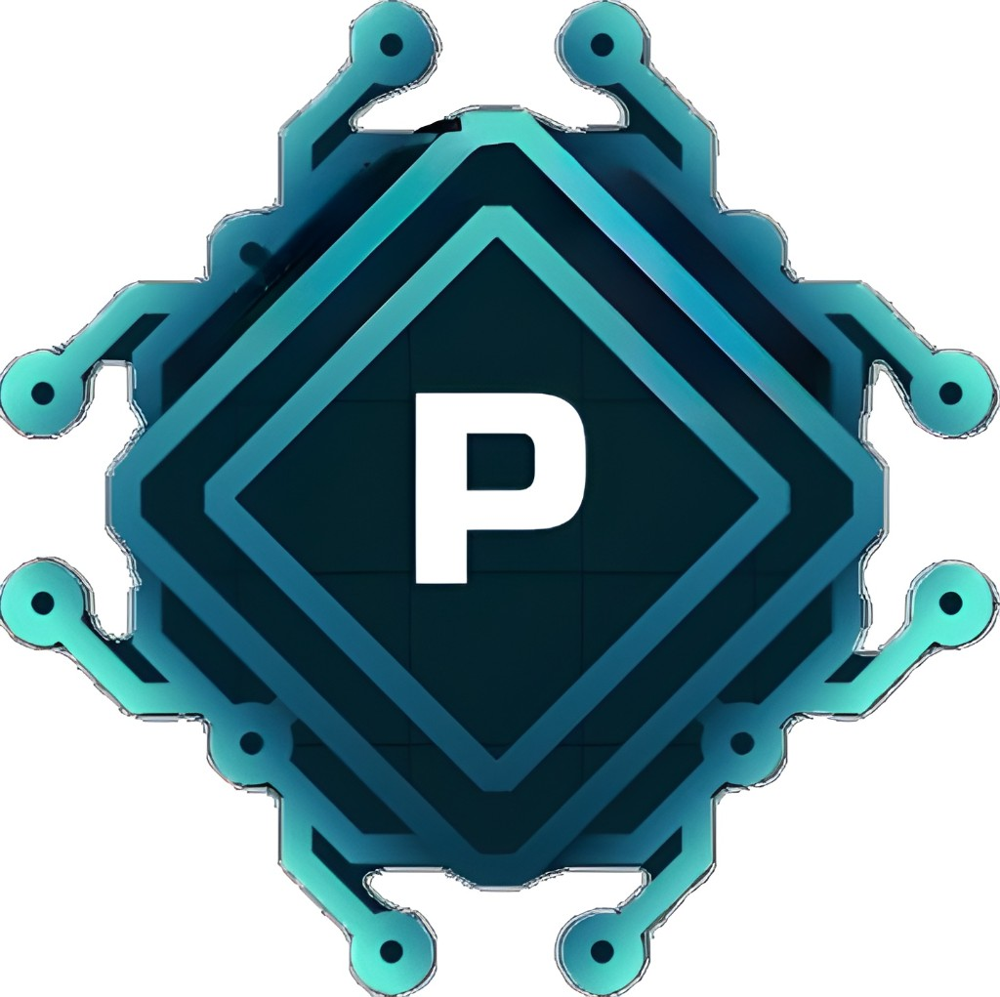

# About ProDraft AI

## Clear. Professional. Compliant communication.

---

## What is ProDraft AI?

ProDraft AI transforms informal or unclear messages into polished, workplace-ready communication. The platform preserves intent, applies tone and formatting rules, and evaluates risk to help teams communicate clearly and responsibly.

---

## The Problem We Solve

### Before ProDraft AI
❌ Casual language creates unprofessional impressions  
❌ Compliance violations slip through (HIPAA, SEC, EEOC)  
❌ Sensitive data shared through wrong channels  
❌ Time wasted rewriting and editing messages  
❌ Legal risks from poorly worded communication  

### With ProDraft AI
✅ Professional communication in seconds  
✅ 11 compliance categories catch violations before they happen  
✅ Real-time education on corporate policies  
✅ Dual risk assessment (input + output)  
✅ Industry-specific rules for Healthcare, Finance, Tech, HR, Legal  

---

## How It Works

### 1. Input Your Message
Type or paste your informal message, along with optional context about the situation.

### 2. Instant Risk Assessment
ProDraft AI scans for 11 compliance risk categories:
- Channel Bypass (personal email requests)
- Financial Disclosure (revenue, earnings)
- HIPAA Medical Info (patient data)
- Customer Data Sharing (GDPR/CCPA)
- Insider Trading (MNPI)
- Legal Discussion (lawsuits)
- Credentials Exposure (passwords)
- Discrimination (hiring bias)
- Regulatory Violations (SEC, FDA)
- PII (email, phone, SSN)
- Confidential Information (NDA content)

### 3. Professional Rewrite
One AI call transforms your message into professional text that:
- Matches your selected tone (Direct, Friendly, Firm, etc.)
- Follows the chosen format (Teams, Email)
- Uses the right template (Status Update, Escalation, etc.)
- Removes compliance risks

### 4. Make Safer (Optional)
If the output still has risks, click "Make Safer" for extra-conservative rewriting that removes all flags.

### 5. Review & Copy
See what changed, check confidence level, review risk scores, then copy to clipboard.

---

## Key Features

### Comprehensive Compliance Detection
- **150+ Keywords** across 11 categories
- **Cumulative Scoring** for multiple violations
- **Industry-Specific Rules** for Healthcare, Finance, Tech, HR, Legal
- **Real-time Education** explains why content is risky

### Dual Risk Assessment
- **Input Risk**: Shows what's wrong with your original message
- **Output Risk**: Confirms the rewritten version is safe
- **Before/After Comparison**: See improvement metrics

### Smart Rewriting
- **One LLM Call**: Fast, low-latency processing
- **Preserves Intent**: Never changes meaning or facts
- **Customizable**: 6 tones, 5 roles, 5 templates, 2 lengths
- **Explains Changes**: 2-4 bullets show what improved

### Optional Parameters
- **Context**: Background about the situation
- **Channel**: Teams (concise) or Email (formal)
- **Tone**: Neutral, Friendly, Firm, Diplomatic, Direct, Empathetic
- **Role Mode**: General, Sales, Support, Engineering, HR
- **Template**: Quick question, Follow up, Status update, Escalation, Apology
- **Length**: Short or Normal

---

## Who Uses ProDraft AI?

### Healthcare Organizations
- **Use Case**: Prevent HIPAA violations in patient communications
- **Risk Prevention**: 45 points for medical information exposure
- **Compliance**: PHI protection, audit-ready documentation

### Financial Institutions
- **Use Case**: Prevent insider trading and SEC violations
- **Risk Prevention**: 50 points for material non-public information
- **Compliance**: MNPI protection, securities law adherence

### Technology Companies
- **Use Case**: Prevent customer data leaks and credential exposure
- **Risk Prevention**: 35-45 points for data sharing, passwords
- **Compliance**: GDPR, CCPA, security policy enforcement

### HR Departments
- **Use Case**: Prevent discrimination in hiring communications
- **Risk Prevention**: 40 points for biased language
- **Compliance**: EEOC regulations, equal opportunity

### Legal Teams
- **Use Case**: Manage litigation communications and confidentiality
- **Risk Prevention**: 20-30 points for legal discussion, NDA breaches
- **Compliance**: Attorney-client privilege, discovery protection

---

## Technology Stack

### Frontend
- **Next.js 16.1**: React framework with server-side rendering
- **TypeScript**: Type-safe development
- **Tailwind CSS**: Utility-first styling
- **Deployment**: Vercel (optimized for Next.js)

### Backend
- **FastAPI**: High-performance Python web framework
- **Pydantic**: Data validation and settings management
- **Backboard SDK**: AI model routing and management
- **Deployment**: Render or Fly.io

### AI & Detection
- **LLM**: Backboard API (routes to optimal models)
- **Risk Scoring**: Deterministic pattern matching (no AI overhead)
- **Compliance Engine**: 150+ keyword detection across 11 categories

---

## Pricing (Future)

### Free Tier
- 10 rewrites per month
- Basic compliance detection (PII, aggressive tone)
- Teams and Email formats

### Pro ($29/month)
- Unlimited rewrites
- Full 11-category compliance suite
- Make Safer mode
- Priority support

### Enterprise (Custom)
- Custom compliance rules
- Admin dashboard and analytics
- API access for integrations
- Dedicated account manager
- SOC 2, HIPAA BAA available

---

## Security & Compliance

### Data Protection
- ✅ No message storage (unless user copies/submits feedback)
- ✅ End-to-end encryption in transit
- ✅ No third-party data sharing
- ✅ GDPR compliant

### Compliance Readiness
- ✅ SOC 2 Type II (in progress)
- ✅ HIPAA ready (BAA available for Enterprise)
- ✅ CCPA compliant
- ✅ ISO 27001 aligned

---

## Roadmap

### Q1 2026 (Current)
- [x] Core rewriting engine
- [x] 11 compliance categories
- [x] Dual risk assessment
- [x] Make Safer mode

### Q2 2026
- [ ] Database persistence for history
- [ ] User accounts and authentication
- [ ] Dashboard with analytics
- [ ] Slack/Teams integrations

### Q3 2026
- [ ] Custom compliance rules per organization
- [ ] Manager approval workflows
- [ ] Reporting and audit exports
- [ ] API for external integrations

### Q4 2026
- [ ] Machine learning for custom detection
- [ ] Multi-language support
- [ ] Mobile apps (iOS, Android)
- [ ] Enterprise SSO integration

---

## Team & Contact

**ProDraft AI** is built by compliance and AI experts passionate about making workplace communication safer and more professional.

- **Website**: https://prodraft.ai (coming soon)
- **Email**: hello@prodraft.ai
- **LinkedIn**: /company/prodraft-ai
- **Twitter**: @prodraft_ai

---

## Open Source

Core risk detection algorithms are open source at:
https://github.com/prodraft-ai/compliance-engine

---

## FAQs

### Is my data private?
Yes. Messages are not stored unless you explicitly copy or submit feedback. All data is encrypted in transit.

### How accurate is the compliance detection?
We use deterministic pattern matching (150+ keywords) with 99%+ accuracy. False positives are possible but rare.

### Can I customize the rules?
Enterprise plans can add custom keywords and adjust risk weights for their organization.

### Does it work offline?
No. ProDraft AI requires an internet connection for AI rewriting.

### What languages are supported?
Currently English only. Multi-language support coming Q4 2026.

### How fast is it?
Typical rewrite takes 2-4 seconds. Risk scoring is instant (< 100ms).

---

**ProDraft AI** - Helping teams communicate clearly, professionally, and compliantly.

© 2026 ProDraft AI. All rights reserved.
